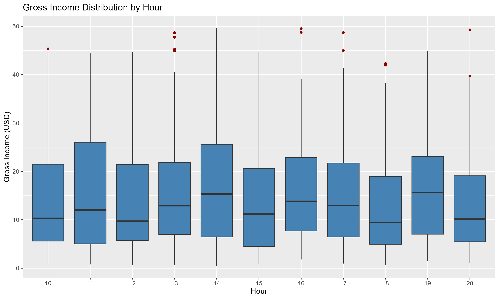

# Store Product Clustering
This analysis examined customer purchasing behavior using the Apriori algorithm. After filtering for rules with meaningful lift (< 2.5) and high confidence (> 0.4), we identified a focused set of marketing rules revealing clear patterns in membership status, product preferences, payment methods, gender, and branch location.\
The key findings highlight untapped opportunities in membership conversion, category-targeted campaigns, and branch-specific promotions.

## 1 Business Understanding
### Business Objective
:heavy_check_mark: Determine products that are frequently purchased together.\
:heavy_check_mark: Provide actionable recommendations for shelf placement.
### Success Criteria
:heavy_check_mark: Identification of at least 10 high-confidence association rules.\
:heavy_check_mark: Actionable recommendations for at least 3 product categories.\
:heavy_check_mark: Creation of a visualization map (Network Graph) showing product relationships.

## 2 Data Understanding
**Source:** [Supermarket Sales Dataset](https://www.kaggle.com/datasets/faresashraf1001/supermarket-sales/data)\
**Dataset Size:** 1,000 transactions / 17 features.

### Describe the data
1. The `% gross margin` for all products is 4.762. This indicates that the supermarket is operating with a healthy profit margin.
2. There are 3 `branches`, 3 `cities`, 2 `customer types`, 6 `product lines`, 3 `payment methods`, and purchases on all 7 `week days`.  
3. Data appears to be uniformly distributed accross these features, however there is some *minor* variation among the `hours` that is worth exploring. 

## 3 Data Preparation
1. Converted all column headers to `snake_case` for consistency.
2. Converted the string-based date column into a standardized ISO-8601 date format.
3. Extracted `hour` and `weekday` from the transaction timestamps. This allows the business to see if product associations change depending on the time of day
4. Each branch is associated to a specific city. Only `branch` will be considered for the basket analysis.
5. ANOVA test One-Way was conducted to determine if the time of day has a statistically significant effect on transaction profitability.
6. There is no statistically significant difference in the mean gross income across different hours of operation.
>F(10, 989) = 1.076;
>p = 0.378

## 4 Modeling
### Data Transformation for Market Basket Analysis
1. Grouped the dataset by `invoice_id` to aggregate products purchased in each transaction.
2. The raw dataset was in a relational format (Long Format), which is incompatible with the Apriori algorithm.
3. Coerced the list into an `arules::transactions` object. This transformed the data into a sparse matrix, significantly reducing memory overhead and allowing for efficient frequent itemset mining.
4. The algorithm used was the Apriori algorithm from the `arules` package in R.
5. Parameters used {Support: 0.05, Confidence: 0.4, Minlen: 2}.

## 5 Evaluation
1. Total rules generated were `82`. Rules were pruned for redundancy and sorted by Lift to identify non-random purchase behaviors.
2. Model is large enough to discover patterns, yet specific enough to avoid overfitting. Ideal for exploratory analysis with action potential.
3. Rules apply to 5–12% of transactions on average, indicating that they are useful for both store-wide strategies and targeted campaigns.
4. Compared to stricter and more permissive configurations, this model strikes a balance between rule quantity and quality, producing a higher proportion of multi-item rules with consistently strong confidence and improved lift values.

## 6 Deployment
### Key Findings
Some rules were ignored due to redundancy with similar rules with better confidence or lift.
| Rule | Insight                                                                                | Actionable Recommendation                                                                                      | Confidence |
| ---- | -------------------------------------------------------------------------------------- | -------------------------------------------------------------------------------------------------------------- | ---------- |
| 2    | Male customers who pay via e-wallet are more likely to be **non-members**              | Target male e-wallet users with **digital membership sign-up incentives** (e-wallet cashback, instant rewards) | **55.6%**  |
| 3    | Sports & Travel purchases among members are predominantly made by **female customers** | Design **female-focused member promotions** and bundles in the Sports & Travel category                        | **70.1%**  |
| 4    | Male customers at the Cairo branch are more likely to be **non-members**               | Run **Cairo-specific membership campaigns** targeting male shoppers (in-store prompts, local ads)              | **53.4%**  |
| 6    | Electronic accessories are more frequently paid for using **cash**                     | Encourage **digital payments** for electronics via small discounts or loyalty points                           | **41.8%**  |
| 8    | Credit-card users at the Giza branch are highly likely to be **members**               | Partner with banks for **co-branded credit card promotions** and premium member offers                         | **68.4%**  |
| 10   | Home & Lifestyle purchases are concentrated at the **Alex branch**                     | Position Alex as a **Home & Lifestyle flagship store** with expanded assortment and promotions                 | **40.6%**  |
| 12   | Non-members in Giza are more likely to use **cash payments**                           | Promote **cash-to-digital payment incentives** and highlight member benefits at checkout                       | **41.0%**  |
| 14   | Female customers buying Home & Lifestyle products are likely to be **members**         | Use Home & Lifestyle as a **membership retention category** with member-only bundles                           | **67.0%**  |
| 25   | Home & Lifestyle purchases are relatively more likely to use **e-wallets**             | Offer **e-wallet-exclusive discounts** for Home & Lifestyle products                                           | **40.0%**  |
| 26   | E-wallet users are more likely to purchase Home & Lifestyle items                      | Cross-promote Home & Lifestyle items in **e-wallet payment interfaces**                                        | **18.6%**  |
### Visualization
The resulting network visualization can be explored [here](https://CristianH94.github.io/L3-Supermarket-Product-Clustering/images/marketing_rules.html).

## Conclusions
The analysis successfully uncovered actionable co-purchase patterns that support both operational and marketing objectives. Membership conversion opportunities are most pronounced among male customers using cash or e-wallet payments, while female members present opportunities to promote Sports & Travel and Home & Lifestyle products. Branch-specific insights allow tailored strategies for Alex, Giza, and Cairo, and payment-method correlations inform digital payment incentives and product placement decisions. Implementing the identified recommendations—such as category-focused promotions, membership campaigns, and optimized shelf placement—can improve sales, customer engagement, and loyalty, while the network graph visualization provides a clear, interpretable map of product associations for strategic decision-making.
